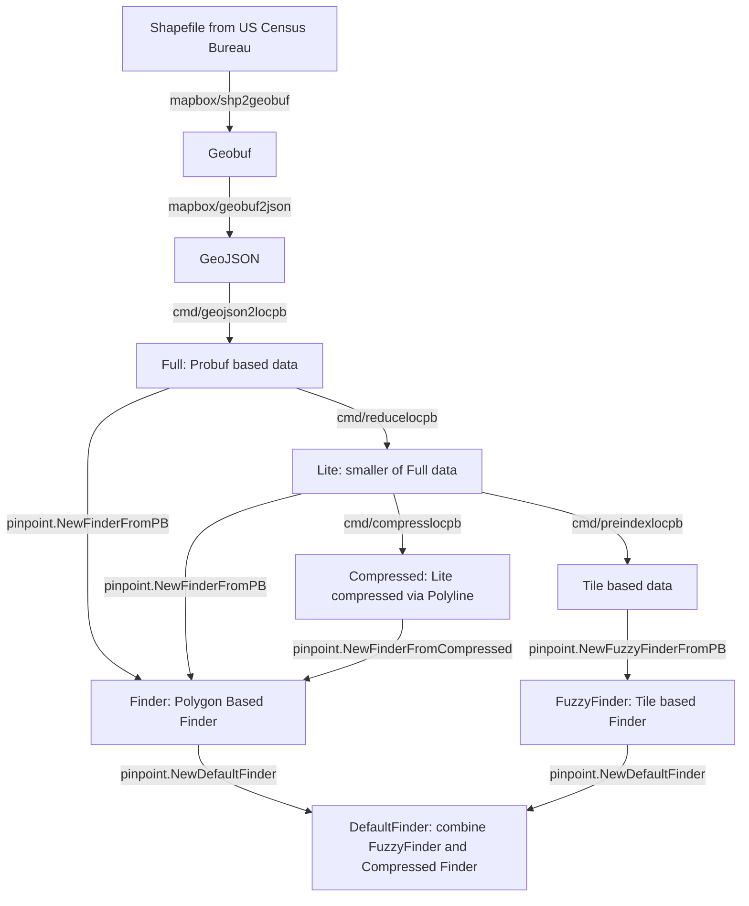

# Pinpint: a fast location finder for Go.

## Quick Start

### Go

```go
// Use about 150MB memory for init, and 60MB after GC.
package main

import (
	"fmt"

	"github.com/deslittle/pinpoint"
)

func main() {
	finder, err := pinpoint.NewDefaultFinder()
	if err != nil {
		panic(err)
	}
	fmt.Println(finder.GetLocationName(116.6387, 40.0786))
}
```

If you need 100% accurate query result, use below to got a finder:

```go
// Use about 900MB memory for init, and 660MB after GC.
package main

import (
	"fmt"

	"github.com/deslittle/pinpoint"
	usstates "github.com/deslittle/pinpoint-us-states"
	"github.com/deslittle/pinpoint/pb"
	"google.golang.org/protobuf/proto"
)

func main() {
	input := &pb.Locations{}

	// Full data, about 83.5MB
	dataFile := usstates.FullData

	if err := proto.Unmarshal(dataFile, input); err != nil {
		panic(err)
	}
	finder, _ := pinpoint.NewFinderFromPB(input)
	fmt.Println(finder.GetLocationName(116.6386, 40.0786))
}
```

### CLI Tool

```bash
go install github.com/deslittle/pinpoint/cmd/pinpoint@latest
pinpoint -lng 116.3883 -lat 39.9289
```

## Data

Preprocessed probuf data can get from <https://github.com/deslittle/pinpoint-us-states>
which has Go's `embed` support. Those files are Protocol Buffers messages for
more efficiency binary distribution like Python wheels, you can view
the [`pb/locinfo.proto`](./pb/locinfo.proto) or it's [HTML format docs][loc_html]
for the internal format info.

pinpoint's data pipeline can be drew as:



The [full data(~80MB)][full-link] could work anywhere but requires more memory usage.

The [lite data(~10MB)][lite-link] doesn't work well in some edge places.

You can see points that results diff in this [page][points_not_equal].

If a little longer init time is acceptable,
the [compressed data(~5MB)][compressd-link] which come from lite data
will be **more friendly for binary distribution.**

The [preindex data(~1.78MB)][preindex-link] are many tiles.
It's used inside the `DefaultFinder`, which built on `FuzzyFinder`, to reduce
raycasting algorithm execution times.

[pb_html]: https://deslittle.github.io/pinpoint/pb.html
[full-link]: https://github.com/deslittle/pinpoint-us-states/blob/main/us-states.pb
[lite-link]: https://github.com/deslittle/pinpoint-us-states/blob/main/us-states.reduce.pb
[preindex-link]: https://github.com/deslittle/pinpoint-us-states/blob/main/us-states.reduce.preindex.pb
[compressd-link]: https://github.com/deslittle/pinpoint-us-states/blob/main/us-states.reduce.compress.pb
[points_not_equal]: https://geojson.io/#id=gist:deslittle/2d958e7f0a279a7411c04907f255955a

## Performance

package pinpoint is designed for high performance geo queries related services like
weather forecast API. And most queries could return in very limited time,
averagely like 2000 nanoseconds.

Here is what have been done for performance improvements:

1. Use preindexes to handle most queries, basically about 1000 nanoseconds
2. Use RTree to filter candidate polygons instead of iter all polygons to reduce
   Ray Casting algorithm execution times
3. Use a fine tuned Ray Casting algorithm package
   <https://github.com/tidwall/geojson> to check if polygon contain point

That's all. There is no black magics inside package pinpoint.

Benchmark run version <https://github.com/deslittle/pinpoint/releases/tag/v0.10.0>

```
goos: darwin
goarch: amd64
pkg: github.com/deslittle/pinpoint
cpu: Intel(R) Core(TM) i9-9880H CPU @ 2.30GHz
BenchmarkDefaultFinder_GetLocationName_Random_WorldCities-16    	  443942	      2583 ns/op
BenchmarkFuzzyFinder_GetLocationName_Random_WorldCities-16      	 1580524	       769.3 ns/op
BenchmarkGetLocationName-16                                     	  184234	      6983 ns/op
BenchmarkGetLocationNameAtEdge-16                               	  145342	      8779 ns/op
BenchmarkGetLocationName_Random_WorldCities-16                  	  130540	      9247 ns/op
BenchmarkFullFinder_GetLocationName-16                          	  164649	      7256 ns/op
BenchmarkFullFinder_GetLocationNameAtEdge-16                    	  136508	      9382 ns/op
BenchmarkFullFinder_GetLocationName_Random_WorldCities-16       	   91137	     12385 ns/op
PASS
ok  	github.com/deslittle/pinpoint	19.073s
```

- <https://deslittle.github.io/pinpoint/>:
  Continuous Benchmark Result
- <https://deslittle.github.io/pinpoint-benchmark/>
  Continuous Benchmark Compared with other packages

## Related Repos

- <https://github.com/deslittle/pinpoint-us-states>
  Preprocessed probuf data release repo
- <https://github.com/deslittle/pinpoint-server>
  HTTP Server for debug

## Thanks

- <https://github.com/paulmach/orb>
- <https://github.com/tidwall/geojson>
